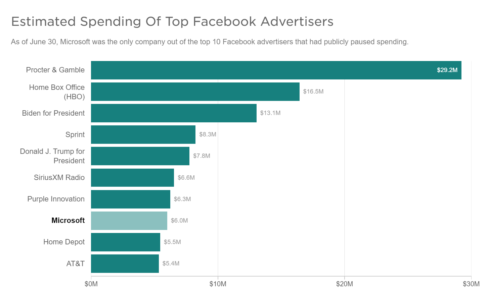

 

    

In the past few days, there has been a rise in the number of companies boycotting Facebook as a platform for advertising. Last I checked, more than 800 companies have pulled out their money from Facebook. It started out initially as a #StopHateForProfit campaign, to call out Facebook to up its game on content moderation, after Facebook didn't take any action on the post by President Trump stating "... Whent he looting starts, the shooting starts", which many people thought provoked violence. (It does, it felt like a dog whistle). And then many small companies, who are relatively active in social issues, jumped in on the #BoycottFacebook movement. And soon other big companies like Unilever, Coca Cola, Ford followed after.

    

While the boycott came quickly, the relationship between advertisers and Facebook has been stressful since a couple of years, and it was just a matter of opportunistic time for advertisers to take a strong stand on the matter, because most of all, every company wants to keep its brand safe and away from hate speech.

Since the advent of new technologies and digital platforms, the world of advertising has changed. Platforms like Facebook, have given advertisers the opportunity to connect with the right audience and not go by the old let's-see-what-sticks method, and spend millions for a widescale advertising campaign. 

But it also brought along a number of problems. 

It was a challenge for advertisers to actually know how many people were even seeing their ads or to know what their ads were appearing next to. Facebook disclosed in 2016 that they had [overestimated how long people actually spent watching ads on their platform](https://money.cnn.com/2016/11/16/technology/facebook-ad-metrics/index.html). The number was **off by around 80%**, which was a real blow to all the advertisers, because from the outside it looked like a really powerful platform with plenty of data to work with, but after this disclosure, it became difficult to trust it, and FB was pushed to start auditing their media metrics.

    

In 2017, YouTube faced a similar issue, when brands realised that their ads were being played before objectionable videos, and many complained like P&G, AT&T etc. and started a boycott and stopped spending money on the platform immediately. And it pushed Google to hire more people to moderate content, spend more on AI to weed out "bad videos" and gave brands more power to decide where their ads would appear.

The fundamental issue here is - AI is still developing, and will need time to perfect itself. And even if companies try and hire a bunch load of people to moderate content, it would take an enormous amount of investment of time, labor and money to actually do it. So this is a real headscratcher.

It remains to be seen whether Facebook will really be dented, either financially or as a brand. 

Additional links:
 
*https://www.socialmediatoday.com/social-networks/complete-list-facebooks-misreported-metrics-and-what-they-mean*
 

