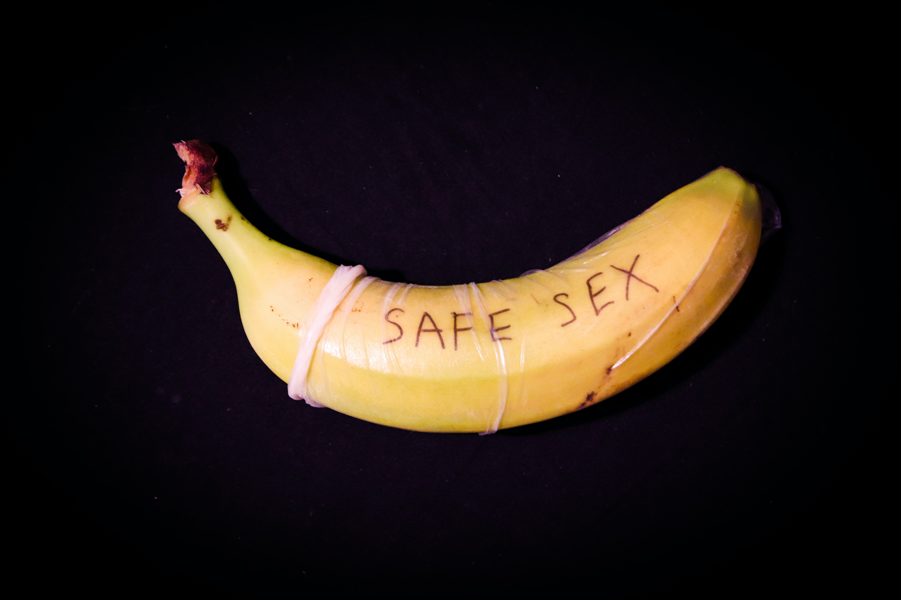

 

    

It was a regular Sunday for me. I was having breakfast and watching a documentary on Sony BBC called "Extreme Engineering", when suddenly a question popped in my head "What happens to used condoms after they are thrown in trash?"

A little context, I gave myself only one goal for 2020, to practice sustainable living by investigating and implementing low-waste alternatives into my lifestyle. Now we know plastic is bad, god knows how many times I have found cows on the street, all bloated and dead, after eating plastic. It's toxic and it's killing us.

I cannot stress enough about how important condoms are for some people, it's the most cost-effective, easily available birth control method on the market, and the only way to prevent STIs/STDs. 

**You should definitely be using a condom.**

But the only question remains, what happens to it afterwards? After it's thrown in the garbage and collected by the garbage truck?z

After some extensive research, I tried to calculate a number to estimate the number of condoms that are being used in a day. It's about - **19.8 million**. And that's a pretty huge number, when you take into account that 39600kgs of waste generated every day will last in the world for some hundreds of years.  
 

#### WHAT ARE CONDOMS MADE OF?

Condom companies are rarely transparent about their ingredients. They use non-visible additives and chemicals, even in <em>‘natural latex’ condoms’</em>, which are rarely 100% natural and thus will not decompose for a long time. But for the sake of being optimistic, latex condoms can be broken down for the most part, polyurethane condoms just can't. And definitely not if it's coated with lubricant or spermicide or if it hits the water.

There just isn't any study to tell us exactly how much time it takes for a condom- lubricated or not- to break down, plus there aren't enough experimental studies done with condoms for some reason.

#### CURRENT SCENARIO

A report by the UN, tells me there are 3 primary ways how condoms are disposed off - 

1. General landfill 
2. Specific burial
3. Incineration

The problem with disposing waste in the ground, other than the risk of scavenging, is that the plastics enter the water cycle and we end up with microplastics inside us. And I am no genius, but that cannot possibly be good for our bodies.

    

That leaves us with the option of burning. The major materials (Rubber, Polyethylene, Hydrocarbons, Silicone) in condoms and their packs are combustible and have a high fuel value. So it is actually an energy-efficient means of disposal if the energy of combustion can be recovered (like using it for electricity production). High temperature incinerators are also used for destroying hazardous medical waste, and may be available for condom destruction. However, it is likely that such incinerators would have a relatively low capacity. (Some good news, finally. But have to check the feasibility for doing so.)
	

#### SO WHAT CAN I DO AS AN INDIVIDUAL?

Well,  a quick search on Google will tell you how to dispose off condoms in the trash and NOT throw it in the recycling bin or flush it down the toilet, or worse, reuse it. UGH. Governments, NGOs, corporations, social marketing organizations have told people to use condoms, but no one ever tells on how to properly dispose them, even though they have the potential to do so. 

Fret not, fellow nature lover, being sexually active and sustainable is an option now. There are people who are working everyday to find an eco-friendly way to degrade condoms, in a controlled environment, without affecting the environment. New companies have come up that are now manufacturing eco-friendly condoms -
1. [Green Condom Club](https://www.greencondom.club/green-condoms)
	They do not contain any toxic chemicals and clearly list the ingredients used for manufacturing, as well as being produced and tested according to the strictest CE and ISO norms to be safe and reliable!
2. [Fair Squared](https://www.fairsquared.info/fairtrade-products-en/condoms-en/)
	The condoms are made from natural latex and fairtrade rubber, ethically farmed in South India, where the company aim to improve the working and living conditions of the primary producers in Kerala. They are certified with a CE mark and tested to the highest possible International standard ISO 4074
3. [Sustain Natural](https://www.sustainnatural.com/products/condoms)
	The Fair Trade rubber is made in a solar-powered factory in a plantation in India, where they pay their workers fair wages and treat them with respect. 

**FUN FACT** : A study shows that going childless is a better way help the environment than recycling or driving an energy-efficient car, it's 20 times more effective, to be exact. So in some ways, condoms are actually good for the environment.

*If you know of some sources that I should read, please do reach out to me on Twitter or email.*

Thank you for indulging me in my exploration of whether condoms can be recycled!

