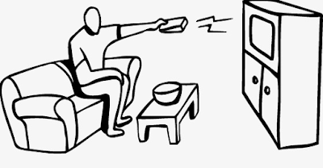

 

    

It's been 9 years and I just realized this recently, that throughout this period I have always been hooked onto some Tv show; I felt a void in my life when I wasn't watching a show. It becomes absolutely necessary for me to start a new series as soon as I'm done with one. I need something to watch when I am having my meals and it just feels strange to eat my food in complete silence, without any distractions.

 
You know how Tv isn't good for you right? Right. But we're humans and we all share one distinct mental flaw (actually many but let's focus on one for now). It's in our habit to utilize our money's worth on objects/services that we pay for. And that's why when I am paying ₹200/month for a Netflix subscription I want to consume as much content as I can. I'm completely genre-agnostic and I have watched shows ranging from *Twin Peaks* to *Futurama* to *Bleach* and even filth like *Desperate Housewives*. I started watching Tv shows actively in 2011 after I was introduced to a funny show called F.R.I.E.N.D.S. And because they had a duration of 20-minutes, I slowly increased the frequency of episodes I could watch at a go. There was a time when I would just play an episode on my laptop and do my work because I liked the background noise. In the time it’s taken me to write this blog, I’ve already dived into several episodes of The IT crowd. (Brilliant show, btw. British humor at its best)

I have tried replacing these series with podcasts but haven't been successful (yet). The worst thing is, I was an avid reader before all of this, now I can only read short stories because my attention span has decreased and of course there are certain other factors that caused this change, I'm sure the availability of a plethora of creative content just a button away, plays an important role here. With the advent of Amazon Prime, Hotstar and the Holy Grail of instant TV, Netflix, television has never been more accessible, which is wonderful for our instant-gratification-generation minds.

 
  

Online TV not only changes the way we consume TV, but also influences the television-viewing experience. In the good old days, if you watch one episode of your favorite show on a Friday, you would have to wait until the next Friday to resume the series, giving you ample amount of time to come act and act as a productive member of society. But if you log on to Netflix and hit play on that first pilot episode of any show, there is nothing stopping you from passively allowing the next episode to automatically play until you’re unsure what day it is. Now I can pick what I want to watch and become absorbed in it, with no commercials to jolt me back to reality or obligations. It is both convenient to know that I can watch TV when it suits me and tempting to waste inordinate amounts of time that should be rather spent of reading papers or learning new skills. 

I'm not sure how many people follow the same routine. A routine that has led me to watch some 70 odd Tv series till date. And it's not like I do it casually, I remember every one of those episodes, for some, I even remember the dialogues by heart (Its nerve wrecking).

There is no silver lining here, except for the fact that I mostly learnt English by watching these shows.

